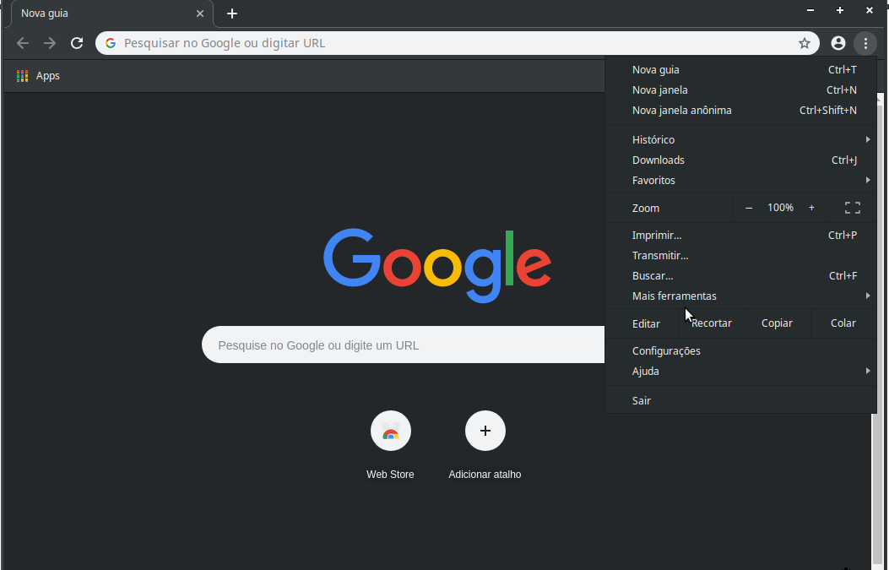

# -- Bot com Selenium-webdriver

## 0 - Introdução  
 -  Automação de tarefas -- exemplificando com devTools  
 -  \<binario-navegador> --remote-debugging-port=\<port> 
 - Manipulação DOM
 - Referencias
   - chromium command-line: https://peter.sh/experiments/chromium-command-line-switches/
   - DevTools Documentação: https://developers.google.com/web/tools/chrome-devtools/?hl=pt-br
   - JavaScript DOM:  https://developer.mozilla.org/pt-BR/docs/DOM/Referencia_do_DOM
## 1 - Ambiente de desenvolvimento 1
 - instalando: selenium-webdriver e chromedriver
 - criando o projeto: ** Ola mundo **
## 2 - Comandos basicos
 - executando javascript, screenshot 
 - getPageSource()
 - ...
## 3 - Buscando e manipulando Elemento em DOM e suas hierarquia
 - Classe By
 - função findElement
## 4 - Buscando e manipulando elemento: part 2
 - função findElements
 - xpath
 - teste de existencia
## 5 - comandos basicos de mause e teclado 
 - key
 - botton
## 6 - wait() 
   - aguardar elemento ou elementos
## 
## Exemplos

### 0 - Introdução 
* #### Dev Tools
  	

* #### Remote Debugger
 	
